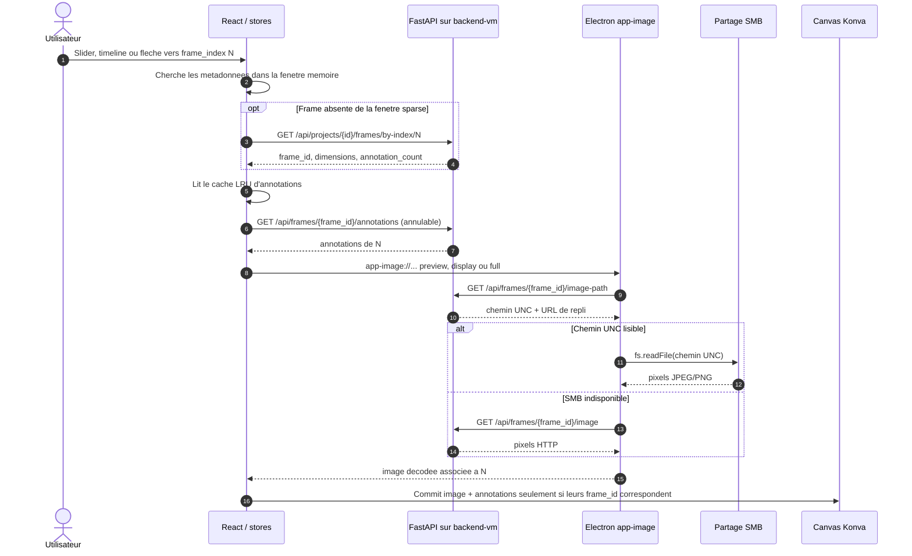
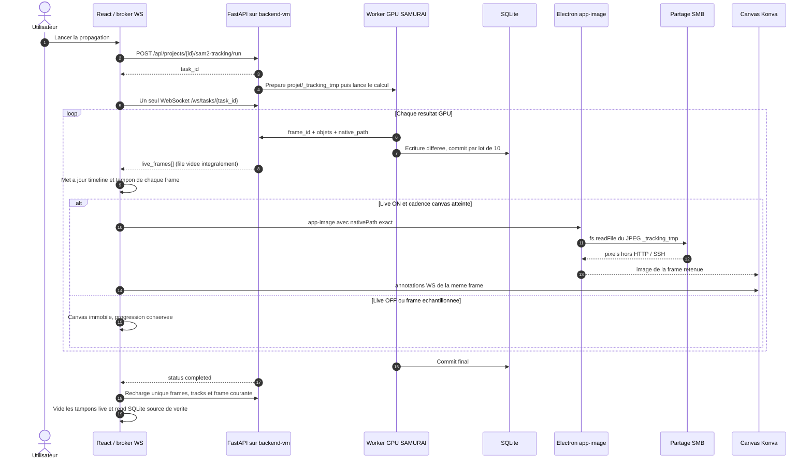

# Optimisations HTTP / SMB

Ce document recense les optimisations de transport et de charge faites sur Annotation App
et VisionNexus, avec les **mesures** qui les justifient. Chaque section dit le symptome
observe, la cause reelle etablie, le correctif, et le gain constate.

Toutes les mesures viennent d'un test de charge du 2026-09-07 : dataset de 9402 PNG
(640x512, 2,6 Go), Annotation App et Dataset Explorer lances en parallele.

## Topologie distante cible

```text
Windows : VisionNexus Electron + frontend
  |-- API JSON + WebSocket --> 127.0.0.1:<port local> -- tunnel SSH --> <backend-vm>:<backend>
  `-- pixels des frames ----> \\<native_share_host>\<partage>\... via app-image://
```

`<backend-vm>` execute FastAPI, SQLite et les modeles. `paths.native_share_host` est le nom UNC
joignable depuis Windows et peut etre different du nom de la VM.
Le navigateur local valide le repli HTTP ; seule une execution VisionNexus connectee a
la VM distante peut valider la lecture SMB physique. La trace backend `NATIF (SMB)` prouve que
le chemin UNC a ete calcule. La preuve de lecture physique est la trace Electron
`[app-image] lecture native confirmee`.

---

## Flux 1 : navigation vers une frame



La timeline n'appelle aucune vignette et ne parcourt pas les indices intermediaires. Un
clic direct sur la frame 2400 demande la frame 2400, pas les frames 1 a 2399. Le prefetch
ne concerne qu'un petit voisinage et ne demarre qu'au repos, hors propagation.

## Flux 2 : run SAMURAI / SAM2



Pendant le run, les **pixels** passent par SMB et les **annotations** par le WebSocket. Les
requetes HTTP restent reservees aux commandes et metadonnees. En navigateur classique, ou
si `fs.readFile` echoue, `app-image` bascule automatiquement sur `GET /image`.

---

## 1. La contrainte de fond : 6 connexions par origine

Un navigateur ouvre au maximum **6 connexions HTTP simultanees par origine**. Quand le
backend est sur une VM, tout ce trafic traverse en plus un **tunnel SSH**. Ces 6 creneaux
sont donc une ressource rare et partagee entre :

- les images de frames (le gros du volume) ;
- les annotations, l'etat des taches, les commandes vitales (stop, sauvegarde).

Toute optimisation ci-dessous revient a la meme idee : **ne pas depenser un creneau pour
quelque chose qui peut passer autrement**.

### Ce que coute une frame

| Pour UNE frame                        | Poids     | Requetes HTTP |
|---------------------------------------|-----------|---------------|
| Message WebSocket complet (annonce)   | 415 o     | **0** (socket deja ouvert) |
| Image preview 480 px                  | 9 726 o   | 1 |
| Image display 1600 px                 | 22 330 o  | 1 |
| Image pleine resolution               | 35 233 o  | 1 |

A 8 frames/s (cadence SAMURAI mesuree) : les annonces WebSocket coutent **3,2 Ko/s et zero
requete**. Faire suivre le canvas image par image en HTTP couterait **79 Ko/s et 8
requetes/s**, soit plus que les 6 creneaux disponibles.

---

## 2. Le chemin natif (SMB) : zero requete HTTP par frame

### Principe

En coquille Electron, le protocole custom `app-image://` peut lire les pixels
**directement sur le partage reseau** (`fs.readFile`) au lieu de les demander en HTTP.
Le trafic ne passe alors ni par le tunnel SSH, ni par les 6 creneaux, ni par le
threadpool du backend.

Traduction du chemin serveur en chemin client : `backend/utils/native_share.py`.

```
/srv/datasets/.../projects/1/frames/f_000042.png
        -> \\<share-host>\datasets\...\projects\1\frames\f_000042.png
```

### Pendant une propagation

La preparation d'un run SAMURAI **ecrit deja** un JPEG 8 bits par frame (LUT appliquee),
celui que SAM2 consomme. Le backend annonce donc simplement ce fichier dans le message
WebSocket, via le champ `native_path` : rien a re-encoder.

Cote client, `app-image://` accepte un parametre `nativePath` qui court-circuite la
resolution. **Deux requetes HTTP economisees par frame** (`/image-path` puis `/image`).
Ce chemin direct est tente meme si la sonde SMB generique de VisionNexus n'est pas active
ou utilise un autre hostname. `fs.readFile` fait foi, avec un timeout de 1,5 s puis un
repli HTTP automatique : la configuration generique ne peut plus desactiver silencieusement
un `native_path` valide envoye par Annotation App.

> **Piege corrige** : le dossier temporaire etait cree sous `/tmp`, qui n'est sous aucune
> racine de partage. `to_native_share_path('/tmp/...')` renvoyait `None`, donc le chemin natif
> n'aurait jamais fonctionne en SMB. Il vit desormais dans `<projet>/_tracking_tmp/`.

**Mesure** : 80/80 messages portent un `native_path`, 79/80 fichiers reellement lisibles
au moment du push (le seul absent est la derniere frame, dossier deja en cours de
nettoyage — le repli HTTP prend le relais).

### Trace dans les logs

Le backend emet une ligne unique par run, jamais par frame :

```
[SAM2Track] apercu temps reel : chemin NATIF (SMB) -> \\<share-host>\... -- lecture directe
            par le client, hors tunnel, 0 requete HTTP par frame
```

Trois variantes possibles : `NATIF (SMB)`, `NATIF (disque local)`, ou `REPLI HTTP` avec la
raison. Cette ligne indique la route prevue. VisionNexus confirme ensuite la route vraiment
utilisee, une seule fois par run :

```
[app-image] lecture native confirmee: \\<share-host>\...\_tracking_tmp\sam2_track_...\000042.jpg
# ou, si fs.readFile echoue :
[app-image] repli HTTP: <raison> (\\<share-host>\...\000042.jpg)
```

---

## 3. Le WebSocket perdait 18 % des frames

### Symptome

Pendant une propagation, les pastilles de la timeline (rouge = pas d'annotation, vert =
annotee) restaient rouges puis viraient au vert d'un coup a la fin.

### Cause

`/ws/tasks/{id}` **echantillonnait** l'etat toutes les 150 ms (6,7/s), alors que
`update_task(live_frame=...)` **ecrase un slot unique** a chaque frame propagee. SAMURAI
tourne a 8 f/s : les frames intercalees etaient ecrasees avant d'etre lues.

**Mesure sur 201 frames : 18 % des frames traitees n'ont jamais ete annoncees.** La
proportion empire quand le GPU accelere.

### Correctif

Une file `live_frames_pending` (deque bornee) remplie a chaque frame, videe integralement
par la boucle WebSocket via `drain_live_frames()` et envoyee dans un tableau `live_frames`.

Le panneau Tracks et la barre de progression ouvraient auparavant **deux WebSockets** sur
la meme tache. Comme `drain_live_frames()` est destructif, le premier socket pouvait vider
la file avant celui qui pilote le canvas : annotations et `native_path` se perdaient alors
de facon aleatoire, et l'image retombait sur HTTP. Un broker frontend conserve maintenant
**une seule connexion physique** et diffuse localement chaque message aux deux composants.

**Apres correctif : 200/201 frames poussees, 0 % de perte** (la seule absente est la frame
de reference, sautee par conception car deja annotee).

---

## 4. Annotations d'apercu : le tampon

Meme apres le correctif ci-dessus, les boites n'apparaissaient pas tout de suite sur
l'image. `handleLiveFramePreview` n'appliquait l'apercu que si le canvas etait **deja** sur
la frame concernee. Or la navigation est throttlee : l'apercu arrivait presque toujours
**avant** que le canvas n'y aille, et etait donc jete.

Correctif : un tampon `liveAnnotationsRef` conserve les apercus recus ; quand le canvas
arrive enfin sur la frame, l'apercu est applique immediatement, sans attendre le flush DB.

### Le throttle de navigation

`interface.propagation_nav_throttle_ms` (**150 ms par defaut**, reglable dans
Parametres > Interface).

Ce reglage echantillonne uniquement les frames dessinees par le canvas. Les pastilles de la
timeline et le tampon recoivent **chaque** frame poussee. Chaque image effectivement
affichee recoit toujours les annotations portant le meme `frame_id`. Mettre 0 fait suivre
chaque resultat GPU ; 700 ms reste utile pour economiser le trafic en repli HTTP.

La valeur historique de 700 ms datait de l'epoque ou chaque saut coutait une requete HTTP.
Le defaut de 150 ms suit maintenant la cadence de vidage du WebSocket (~6,7 Hz) sans
empiler les decodages d'images. Une migration unique remplace l'ancien defaut sauvegarde
de 700 ms par 150 ms ; toute autre valeur personnalisee est preservee.

### Pourquoi les annotations n'apparaissaient qu'une frame sur dix

Le callback traitait correctement `live_frames[]`, puis appelait la navigation avec
`liveFrame=null` parce que le lot avait deja ete consomme. Ce `null` etait interprete comme
« aucune donnee live » et declenchait `GET /annotations`. SAMURAI commitant SQLite par lots
de 10 frames, le GET renvoyait encore `[]` et effacait immediatement l'overlay WebSocket.

Correctif : `applyUpdate` recoit un booleen explicite `hasLivePayload`. Des qu'un lot WS a
ete recu, aucune relecture DB n'est autorisee pendant le run. La base ne redevient source de
verite qu'apres le commit et la resynchronisation finale.

### Activation du live

`interface.realtime_live_enabled` (**true par defaut**, reglable dans Parametres >
Interface) est la source de verite pour le suivi live. Quand il est actif, TrackPanel suit
`current_frame_id`, applique les annotations poussees par `live_frames`, et le canvas tente
le chemin `nativePath`/`app-image://` sous Electron. Aucun controle duplique n'est conserve
dans le panneau gauche.

Quand le live est desactive, la progression, les compteurs et les apercus continuent
d'arriver par le WebSocket, mais le canvas reste sur la frame choisie par l'utilisateur.
A la fin de la tache, frames, tracks et annotations sont relus en base en une seule
resynchronisation.

### Ecran gris au lancement d'une propagation

Deux erreurs frontend distinctes pouvaient demonter toute la page React :

1. Pendant une tache, le chargeur normal appliquait encore un cache DB obsolete avant de
   verifier que la propagation etait active. Le tampon WebSocket appliquait ensuite la
   version live. Le compteur de timeline relancait les deux effets, qui alternaient par
   exemple `cache(0)` et `live(1)` jusqu'a `Maximum update depth exceeded`.
2. Electron peut mesurer un onglet masque ou reorganise a `0x0`. Cette taille etait envoyee
   a Konva, qui mettait ses buffers internes a zero. Un dessin differe levait ensuite
   `InvalidStateError: drawImage ... width or height of 0`.

Correctifs a la source, sans error boundary :

- pendant toute propagation, le WebSocket est l'unique source d'annotations du canvas ;
  le cache et les lectures DB reprennent seulement apres la resynchronisation finale ;
- `loadAnnotations` est idempotent et ne publie aucun nouvel etat si frame et tableau sont
  deja identiques ;
- l'effet du tampon live depend de la frame courante stable, pas du tableau `frames` que les
  compteurs modifient ;
- `AnnotationCanvas` ignore les mesures nulles et conserve sa derniere taille valide.

**Live ON** : le canvas suit la navigation cadencee, lit les JPEG via SMB/app-image sous
Electron et applique le tampon WebSocket. **Live OFF** : le canvas ne bouge pas pendant le
calcul ; le meme isolement cache/DB evite les etats concurrents, puis la base devient a
nouveau la source de verite a la fin.

---

## 5. Saturation du pool de connexions SQL

### Symptome

Application entierement figee, popup « Le backend ne repond pas », **sans aucun calcul GPU
en cours**.

### Cause

SQLAlchemy 2.x utilise un `QueuePool` **meme pour un SQLite sur fichier** :

```
pool_size 5 + max_overflow 10 = 15 connexions maximum
pool_timeout = 30 s
```

Or les endpoints FastAPI declares en `def` tournent dans le threadpool anyio, qui compte
**40 threads**. Jusqu'a 40 requetes pouvaient donc reclamer une session pour 15 connexions.
Les autres attendaient `pool_timeout`, soit **exactement le timeout axios du frontend**,
d'ou le popup sur toutes les requetes en vol.

Ce qui remplissait le pool : `frame_histogram` et `serve_frame_image` gardent leur
connexion pendant un `cv2.imread` d'un PNG 16 bits situe sur un **montage reseau**.
Quelques frames en vol suffisaient.

### Correctifs

1. **Pool redimensionne** au-dessus du threadpool : `pool_size=20`, `max_overflow=40`,
   soit 60 connexions pour 40 threads. Une requete ne peut plus attendre une connexion.
2. **Cache LRU des histogrammes** : un histogramme porte sur les valeurs **brutes**, il ne
   depend ni de la LUT ni d'aucun reglage d'affichage, et les pixels sources ne changent
   jamais apres l'import. Il est donc calculable une seule fois.

**Mesure** : x5 en unitaire, x4,5 en rafale (sur SSD local ; le gain est bien superieur sur
montage reseau, la ou le probleme se produisait).

> Attention pour la suite : le dimensionnement du pool est relatif au threadpool anyio par
> defaut (40). Si ce reglage change, le pool doit rester au-dessus.

---

## 6. Placeholder mis en cache a vie

### Symptome

Plus aucune image au lancement, puis retour a la normale apres avoir relance l'application.

### Cause

Le backend renvoie son placeholder gris en **HTTP 200** (c'est une image JPEG valide, pas
une erreur). `imageProtocol.ts` mettait donc en cache ce gris comme la vraie frame, dans un
cache memoire qui vit aussi longtemps que le process Electron. Un echec transitoire au
demarrage figeait la frame en gris jusqu'a relancer.

### Correctif

- Backend : `Cache-Control: no-store` + en-tete `X-Frame-Missing` sur le placeholder, avec
  la raison (`broken-symlink` ou `not-extracted`).
- Electron : `isProvisional()` sert l'image sans jamais la memoriser.

---

## 7. Readiness du backend au lancement

`waitUntilReady()` ne sondait que le port **frontend** (Vite, pret en ~800 ms), alors que le
backend met 10 a 40 s (torch/CUDA, SAMService, XFeat). L'onglet s'ouvrait trop tot, les
requetes d'amorcage partaient dans le vide (`[vite] http proxy error: /api/projects`) et
n'etaient jamais rejouees : l'application restait vide, sans projet.

Correctif : `waitUntilBackendReady()` sonde `/health` sur le port backend, avec un message
« Backend en cours de demarrage (chargement des modeles)... » apres 3 s.

---

## 8. Cache disque des images

`frames_preview/` et `frames_8bit/` nomment leurs JPEG avec la signature de la LUT :

```
<stem>_prev<width>_<sig>.jpg        <stem>_8bit_<sig>.jpg
```

Chaque changement de LUT creait une generation complete sans jamais nettoyer l'ancienne.
Constate sur un projet reel : **10 signatures mortes coexistantes**, 1511 fichiers pour
4410 frames.

Correctif : `purge_stale_lut_caches()` appele depuis les trois endpoints d'ecriture de LUT.
Seules les signatures vivantes (projet + chaque sequence) sont conservees.

> Piege : une signature manuelle vaut `man<lo>_<hi>` et **contient un underscore**. Ne
> jamais parser ces noms avec `rpartition("_")`.

---

## 9. Cote frontend

- **`annotationsCacheRef`** etait une `Map` sans limite, videe uniquement au changement de
  projet. Bornee a 600 entrees (LRU).
- **Carte Dataset Explorer** : Plotly en `type: 'scatter'` rend en **SVG**, un noeud `<path>` par
  point. Sur 9402 points cela faisait 9402 noeuds, soit **96 % du DOM de la page**.
  Passage en `scattergl` (WebGL, meme bundle) :

  | Operation                | SVG    | WebGL  | Gain |
  |--------------------------|--------|--------|------|
  | Selection 50 % des points| 354 ms | 43 ms  | x8   |
  | Deselection              | 335 ms | 54 ms  | x6   |
  | Zoom                     | 246 ms | 16 ms  | x16  |
  | Dezoom                   | 245 ms | 12 ms  | x21  |
  | Re-render complet        | 90 ms  | 4,5 ms | x20  |

  DOM total : 9798 -> 392 noeuds. C'est un gain de **latence**, pas de memoire (le heap JS
  ne bouge que de 3 Mo : les noeuds SVG vivent en memoire native).

- **Remanence d'image** : `useCancellableLiveImage` ne remettait jamais son etat a `null`
  et gardait indefiniment sa derniere image. En navigation normale, `useImage` repasse a
  `undefined` le temps de charger, le repli `?? liveImage` faisait alors reapparaitre une
  image d'une **autre frame**. Corrige en retenant l'URL associee a l'image et en ne la
  rendant que si elle correspond encore.

---

## 10. Ou passe la memoire

A ne pas confondre, ce sont des process differents :

- **Backend Python** : ~1,0 Go au repos, ~2,1-2,2 Go en pic (torch/CUDA/SAM2 charges a la
  demande). Sur une VM, cette memoire est **sur la VM**, pas sur le poste client.
- **Electron** : 787 Mo mesures sur 7 process (3 renderers, GPU, main, utility). Le
  Gestionnaire des taches Windows les **additionne** sous un seul nom.

Un navigateur garde l'image **decodee**, pas le JPEG : une frame 640x512 pese 9,7 Ko en
preview mais **1,25 Mo decodee en RGBA**, soit un facteur ~135.

Ce que l'application retient elle-meme ne croit **pas** avec la taille du dataset : le
canvas ne garde qu'une image, le prefetch cree des `Image` jamais stockees, la timeline est
virtualisee, et la liste de frames coute ~20 Mo a 20 000 frames. Passer de 9 000 a 20 000
frames n'ajoute donc que quelques dizaines de megaoctets.

---

## Mesures de reference (baseline)

A reutiliser pour comparer apres une modification.

| Operation | Valeur |
|-----------|--------|
| Embedding 9402 images (Dataset Explorer) | ~47 img/s, 238 s au total |
| Import Annotation 9402 frames (symlink) | ~110 s |
| Propagation SAMURAI | ~8 frames/s |
| Latence backend pendant deux jobs simultanes | mediane 8-16 ms, p95 30-59 ms, 0 echec |
| Seuil du popup « backend ne repond pas » | 30 000 ms |

---

## Points de vigilance

1. Les JPEG du dossier `_tracking_tmp` ne vivent **que pendant le run**. Le `fallback` HTTP
   present dans l'URL `app-image://` est donc obligatoire, ne pas le retirer.
2. Le dimensionnement du pool SQL est relatif au threadpool anyio (40 threads).
3. `to_native_share_path()` ne traduit que les chemins sous une racine partagee
   (`home`, `mnt`, `srv`, `media`, `data`). Tout fichier destine a une lecture native doit
   vivre sous l'une d'elles.
4. Le throttle echantillonne les frames dessinees, mais une frame affichee doit toujours
   porter son overlay du meme `frame_id`. Un overlay absent n'est jamais un effet attendu du
   throttle.
