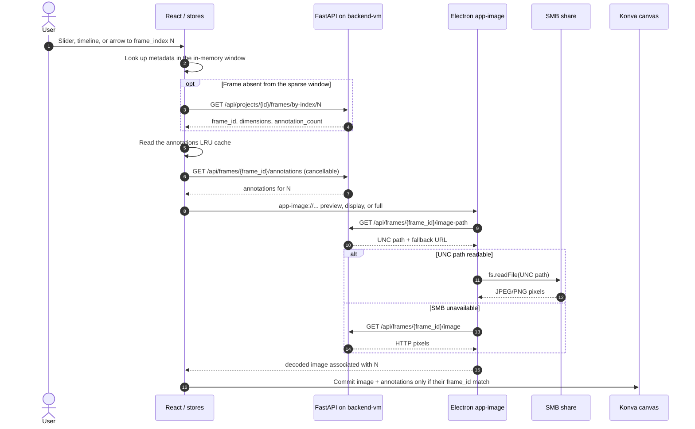
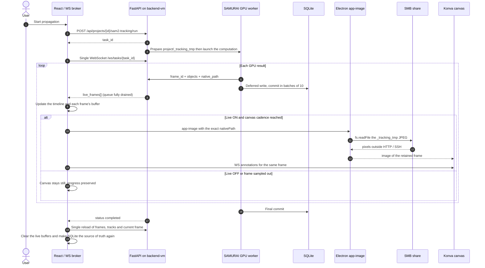

*[Lire en francais](optimisation_http_smb.fr.md)*

# HTTP / SMB Optimizations

This document lists the transport and load optimizations made to Annotation App
and VisionNexus, with the **measurements** that justify them. Each section states the
observed symptom, the established real cause, the fix, and the measured gain.

All measurements come from a load test run on 2026-09-07: a 9402-PNG dataset
(640x512, 2.6 GB), Annotation App and Dataset Explorer running in parallel.

## Target remote topology

```text
Windows: VisionNexus Electron + frontend
  |-- JSON API + WebSocket --> 127.0.0.1:<local port> -- SSH tunnel --> <backend-vm>:<backend>
  `-- frame pixels ----> \\<native_share_host>\<share>\... via app-image://
```

`<backend-vm>` runs FastAPI, SQLite and the models. `paths.native_share_host` is the UNC name
reachable from Windows and can be different from the VM's name.
The local browser can only validate the HTTP fallback path; only a VisionNexus run connected to
the remote VM can validate the actual SMB read. The backend trace `NATIVE (SMB)` proves that
the UNC path was computed. The proof of an actual physical read is the Electron trace
`[app-image] native read confirmed`.

---

## Flow 1: navigating to a frame



The timeline never requests thumbnails and never walks through intermediate indices. A
direct click on frame 2400 requests frame 2400, not frames 1 through 2399. Prefetch
only covers a small neighborhood and only starts at rest, outside propagation.

## Flow 2: SAMURAI / SAM2 run



During the run, **pixels** go through SMB and **annotations** go through the WebSocket.
HTTP requests remain reserved for commands and metadata. In a regular browser, or
if `fs.readFile` fails, `app-image` automatically falls back to `GET /image`.

---

## 1. The underlying constraint: 6 connections per origin

A browser opens at most **6 simultaneous HTTP connections per origin**. When the
backend is on a VM, all this traffic additionally goes through an **SSH tunnel**. These 6 slots
are therefore a scarce resource shared between:

- frame images (the bulk of the volume);
- annotations, task state, vital commands (stop, save).

Every optimization below comes down to the same idea: **don't spend a slot on
something that can go through another route**.

### What one frame costs

| For ONE frame                          | Size      | HTTP requests |
|-----------------------------------------|-----------|---------------|
| Full WebSocket message (announcement)   | 415 B     | **0** (socket already open) |
| 480 px preview image                    | 9,726 B   | 1 |
| 1600 px display image                   | 22,330 B  | 1 |
| Full-resolution image                   | 35,233 B  | 1 |

At 8 frames/s (measured SAMURAI cadence): WebSocket announcements cost **3.2 KB/s and zero
requests**. Following the canvas frame by frame over HTTP would cost **79 KB/s and 8
requests/s**, more than the 6 available slots.

---

## 2. The native path (SMB): zero HTTP request per frame

### Principle

In the Electron shell, the custom `app-image://` protocol can read pixels
**directly from the network share** (`fs.readFile`) instead of requesting them over HTTP.
The traffic then goes through neither the SSH tunnel, nor the 6 slots, nor the
backend's threadpool.

Translation of the server path into a client path: `backend/utils/native_share.py`.

```
/srv/datasets/.../projects/1/frames/f_000042.png
        -> \\<share-host>\datasets\...\projects\1\frames\f_000042.png
```

### During a propagation

Preparing a SAMURAI run **already writes** an 8-bit JPEG per frame (LUT applied),
the one SAM2 consumes. The backend therefore simply announces this file in the
WebSocket message, via the `native_path` field: nothing to re-encode.

On the client side, `app-image://` accepts a `nativePath` parameter that short-circuits
resolution. **Two HTTP requests saved per frame** (`/image-path` then `/image`).
This direct path is attempted even if VisionNexus's generic SMB probe is not active
or uses a different hostname. `fs.readFile` is authoritative, with a 1.5 s timeout then an
automatic HTTP fallback: the generic configuration can no longer silently disable
a valid `native_path` sent by Annotation App.

> **Fixed pitfall**: the temp folder used to be created under `/tmp`, which is not under any
> share root. `to_native_share_path('/tmp/...')` returned `None`, so the native path
> would never have worked over SMB. It now lives under `<project>/_tracking_tmp/`.

**Measurement**: 80/80 messages carry a `native_path`, 79/80 files actually readable
at push time (the only missing one is the last frame, whose folder was already being
cleaned up -- the HTTP fallback takes over).

### Trace in the logs

The backend emits a single line per run, never per frame:

```
[SAM2Track] real-time preview: NATIVE path (SMB) -> \\<share-host>\... -- direct read
            by the client, outside the tunnel, 0 HTTP requests per frame
```

Three possible variants: `NATIVE (SMB)`, `NATIVE (local disk)`, or `HTTP FALLBACK` with the
reason. This line indicates the intended route. VisionNexus then confirms the route actually
used, once per run:

```
[app-image] native read confirmed: \\<share-host>\...\_tracking_tmp\sam2_track_...\000042.jpg
# or, if fs.readFile fails:
[app-image] HTTP fallback: <reason> (\\<share-host>\...\000042.jpg)
```

---

## 3. The WebSocket was losing 18% of the frames

### Symptom

During a propagation, the timeline dots (red = no annotation, green =
annotated) stayed red and then suddenly turned green all at once at the end.

### Cause

`/ws/tasks/{id}` **sampled** the state every 150 ms (6.7/s), while
`update_task(live_frame=...)` **overwrites a single slot** on every propagated frame. SAMURAI
runs at 8 f/s: the in-between frames were overwritten before being read.

**Measured over 201 frames: 18% of processed frames were never announced.** The
proportion gets worse as the GPU speeds up.

### Fix

A `live_frames_pending` queue (bounded deque) is filled on every frame,
fully drained by the WebSocket loop via `drain_live_frames()`, and sent as a `live_frames`
array.

The Tracks panel and the progress bar used to open **two WebSockets** on
the same task. Since `drain_live_frames()` is destructive, the first socket could drain
the queue before the one driving the canvas: annotations and `native_path` were then
randomly lost, and the image fell back to HTTP. A frontend broker now keeps
**a single physical connection** and locally broadcasts every message to both components.

**After the fix: 200/201 frames pushed, 0% loss** (the only missing one is the
reference frame, skipped by design since it is already annotated).

---

## 4. Preview annotations: the buffer

Even after the fix above, the boxes did not appear immediately on the
image. `handleLiveFramePreview` only applied the preview if the canvas was **already** on
the relevant frame. But navigation is throttled: the preview almost always arrived
**before** the canvas got there, and was therefore discarded.

Fix: a `liveAnnotationsRef` buffer keeps the received previews; when the canvas
finally reaches the frame, the preview is applied immediately, without waiting for the DB flush.

### The navigation throttle

`interface.propagation_nav_throttle_ms` (**150 ms by default**, adjustable in
Settings > Interface).

This setting only samples the frames drawn by the canvas. The timeline dots and the
buffer receive **every** pushed frame. Every image actually displayed always
receives the annotations carrying the same `frame_id`. Setting it to 0 follows
every GPU result; 700 ms is still useful to save traffic when on the HTTP fallback.

The historical value of 700 ms dated from when every jump cost an HTTP request.
The 150 ms default now follows the WebSocket drain cadence (~6.7 Hz) without
stacking up image decodes. A one-time migration replaces the previously saved
default of 700 ms with 150 ms; any other custom value is preserved.

### Why annotations only showed up on one frame out of ten

The callback correctly processed `live_frames[]`, then called navigation with
`liveFrame=null` because the batch had already been consumed. This `null` was interpreted as
"no live data" and triggered a `GET /annotations`. Since SAMURAI commits to SQLite in batches
of 10 frames, the GET still returned `[]` and immediately wiped the WebSocket overlay.

Fix: `applyUpdate` receives an explicit `hasLivePayload` boolean. As soon as a WS batch has
been received, no DB re-read is allowed during the run. The database only becomes the
source of truth again after the commit and the final resync.

### Enabling live mode

`interface.realtime_live_enabled` (**true by default**, adjustable in Settings >
Interface) is the source of truth for live tracking. When active, TrackPanel follows
`current_frame_id`, applies the annotations pushed via `live_frames`, and the canvas attempts
the `nativePath`/`app-image://` path under Electron. No duplicate control is kept
in the left panel.

When live is disabled, progress, counters, and previews keep
arriving over the WebSocket, but the canvas stays on the frame chosen by the user.
At the end of the task, frames, tracks, and annotations are reloaded from the database in a
single resync.

### Gray screen when starting a propagation

Two distinct frontend errors could tear down the whole React page:

1. During a task, the normal loader was still applying a stale DB cache before
   checking whether propagation was active. The WebSocket buffer then applied the
   live version. The timeline counter re-triggered both effects, which alternated between,
   for example, `cache(0)` and `live(1)` until `Maximum update depth exceeded`.
2. Electron can measure a hidden or reflowed tab as `0x0`. This size was sent
   to Konva, which zeroed out its internal buffers. A deferred draw then raised
   `InvalidStateError: drawImage ... width or height of 0`.

Fixes at the source, with no error boundary:

- throughout any propagation, the WebSocket is the canvas's sole source of annotations;
  the cache and DB reads only resume after the final resync;
- `loadAnnotations` is idempotent and publishes no new state if the frame and array are
  already identical;
- the live buffer's effect depends on the stable current frame, not on the `frames` array that
  the counters modify;
- `AnnotationCanvas` ignores zero measurements and keeps its last valid size.

**Live ON**: the canvas follows the throttled navigation, reads JPEGs via SMB/app-image under
Electron, and applies the WebSocket buffer. **Live OFF**: the canvas does not move during the
computation; the same cache/DB isolation avoids concurrent states, then the database becomes
the source of truth again at the end.

---

## 5. SQL connection pool saturation

### Symptom

The application completely frozen, "Backend not responding" popup, **with no GPU
computation running**.

### Cause

SQLAlchemy 2.x uses a `QueuePool` **even for a file-based SQLite**:

```
pool_size 5 + max_overflow 10 = 15 connections maximum
pool_timeout = 30 s
```

But FastAPI endpoints declared with `def` run in the anyio threadpool, which has
**40 threads**. Up to 40 requests could therefore compete for a session against 15 connections.
The others waited out `pool_timeout`, which happens to be **exactly the frontend's axios
timeout**, hence the popup on every in-flight request.

What filled up the pool: `frame_histogram` and `serve_frame_image` hold their
connection during a `cv2.imread` of a 16-bit PNG located on a **network mount**.
A few frames in flight were enough.

### Fixes

1. **Pool resized** above the threadpool: `pool_size=20`, `max_overflow=40`,
   i.e. 60 connections for 40 threads. A request can no longer wait for a connection.
2. **LRU cache for histograms**: a histogram is computed on **raw** values, it does not
   depend on the LUT or any display setting, and the source pixels never
   change after import. It can therefore be computed once.

**Measurement**: x5 for a single call, x4.5 under burst load (on local SSD; the gain is far
larger on a network mount, where the problem actually occurred).

> Note for later: the pool sizing is relative to the anyio threadpool default (40). If
> that setting changes, the pool must stay above it.

---

## 6. Placeholder cached forever

### Symptom

No image at all on launch, then back to normal after restarting the application.

### Cause

The backend returns its gray placeholder as **HTTP 200** (it's a valid JPEG image, not
an error). `imageProtocol.ts` therefore cached this gray image as the real frame, in an
in-memory cache that lives as long as the Electron process. A transient failure at
startup would freeze the frame gray until a restart.

### Fix

- Backend: `Cache-Control: no-store` + `X-Frame-Missing` header on the placeholder, with
  the reason (`broken-symlink` or `not-extracted`).
- Electron: `isProvisional()` serves the image without ever caching it.

---

## 7. Backend readiness at launch

`waitUntilReady()` only probed the **frontend** port (Vite, ready in ~800 ms), while the
backend takes 10 to 40 s (torch/CUDA, SAMService, XFeat). The tab opened too
early, the bootstrap requests went nowhere (`[vite] http proxy error: /api/projects`) and
were never replayed: the application stayed empty, with no project.

Fix: `waitUntilBackendReady()` probes `/health` on the backend port, with a message
"Backend starting up (loading models)..." after 3 s.

---

## 8. Disk image cache

`frames_preview/` and `frames_8bit/` name their JPEGs with the LUT signature:

```
<stem>_prev<width>_<sig>.jpg        <stem>_8bit_<sig>.jpg
```

Every LUT change created a full new generation without ever cleaning up the old one.
Observed on a real project: **10 dead signatures coexisting**, 1511 files for
4410 frames.

Fix: `purge_stale_lut_caches()` called from the three LUT write endpoints.
Only live signatures (project + each sequence) are kept.

> Pitfall: a manual signature is worth `man<lo>_<hi>` and **contains an underscore**. Never
> parse these names with `rpartition("_")`.

---

## 9. On the frontend side

- **`annotationsCacheRef`** was an unbounded `Map`, only cleared on project change. Bounded to
  600 entries (LRU).
- **Dataset Explorer chart**: Plotly's `type: 'scatter'` renders as **SVG**, one `<path>` node per
  point. At 9402 points that meant 9402 nodes, i.e. **96% of the page's DOM**.
  Switching to `scattergl` (WebGL, same bundle):

  | Operation                | SVG    | WebGL  | Gain |
  |--------------------------|--------|--------|------|
  | Selecting 50% of points  | 354 ms | 43 ms  | x8   |
  | Deselecting              | 335 ms | 54 ms  | x6   |
  | Zoom                     | 246 ms | 16 ms  | x16  |
  | Zoom out                 | 245 ms | 12 ms  | x21  |
  | Full re-render           | 90 ms  | 4.5 ms | x20  |

  Total DOM: 9798 -> 392 nodes. This is a **latency** gain, not a memory one (the JS heap
  only moves by 3 MB: SVG nodes live in native memory).

- **Image ghosting**: `useCancellableLiveImage` never reset its state to `null`
  and indefinitely kept its last image. During normal navigation, `useImage` switches back to
  `undefined` while loading, and the `?? liveImage` fallback would then make an image
  from **another frame** reappear. Fixed by tracking the URL associated with the image and only
  rendering it if it still matches.

---

## 10. Where the memory goes

Not to be confused, these are different processes:

- **Python backend**: ~1.0 GB at rest, ~2.1-2.2 GB at peak (torch/CUDA/SAM2 loaded on
  demand). On a VM, this memory is **on the VM**, not on the client machine.
- **Electron**: 787 MB measured across 7 processes (3 renderers, GPU, main, utility). The
  Windows Task Manager **adds them up** under a single name.

A browser keeps the **decoded** image, not the JPEG: a 640x512 frame weighs 9.7 KB in
preview but **1.25 MB decoded as RGBA**, a factor of ~135.

What the application itself retains does **not** grow with dataset size: the
canvas keeps only one image, prefetch creates `Image` objects that are never stored, the timeline is
virtualized, and the frame list costs ~20 MB at 20,000 frames. Going from 9,000 to 20,000
frames therefore only adds a few dozen megabytes.

---

## Baseline measurements

To reuse for comparison after a change.

| Operation | Value |
|-----------|--------|
| Embedding 9402 images (Dataset Explorer) | ~47 img/s, 238 s total |
| Annotation import of 9402 frames (symlink) | ~110 s |
| SAMURAI propagation | ~8 frames/s |
| Backend latency during two simultaneous jobs | median 8-16 ms, p95 30-59 ms, 0 failures |
| "Backend not responding" popup threshold | 30,000 ms |

---

## Points of caution

1. The JPEGs in the `_tracking_tmp` folder only live **for the duration of the run**. The `fallback`
   HTTP path present in the `app-image://` URL is therefore mandatory, do not remove it.
2. The SQL pool sizing is relative to the anyio threadpool (40 threads).
3. `to_native_share_path()` only translates paths under a shared root
   (`home`, `mnt`, `srv`, `media`, `data`). Any file meant for a native read must
   live under one of these.
4. The throttle samples the drawn frames, but a displayed frame must always
   carry its overlay from the same `frame_id`. A missing overlay is never an expected effect of
   the throttle.
