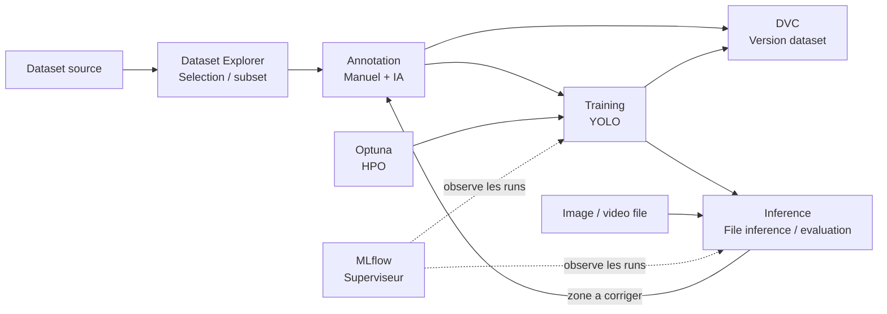
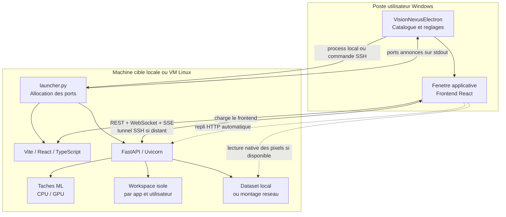

*[Lire en francais](README.fr.md)*

<p align="center">
  
</p>

<h1 align="center">VisionNexus</h1>

<p align="center">
  A modular computer vision suite for exploring, annotating, training,
  evaluating and versioning datasets, locally or on a Linux VM.
</p>

<p align="center">
  
  
  
  
  
  
</p>

VisionNexus is built from independent applications, each with its own
frontend, API and user workspace. They can be launched standalone from the
command line or opened in the Electron client. The Orchestrator then links
them together into visual MLOps pipelines.

<!-- branch-licence:start -->
> **`main` branch**: in-house YOLOX engine, no Ultralytics dependency.
> Distributed under `AGPL-3.0-only` or a commercial license. A variant with
> the Ultralytics plugin, AGPL-3.0 only, lives on the `ultralytics` branch.
<!-- branch-licence:end -->

> The repository contains the source and lock files. Node dependencies,
> Python environments and model weights are rebuilt or installed on the
> target machine.

## Overview

<p align="center">
  
</p>

<p align="center">
  <em>Orchestrator and seven applications: every stage of the dataset -&gt;
  annotation -&gt; training -&gt; inference cycle stays usable on its own or
  wired into a pipeline.</em>
</p>

<p align="center">
  
</p>

<p align="center">
  <em>Annotation App: creating a project, drawing the first box, SAMURAI
  propagation across the sequence, segmentation masks that track objects,
  YOLO/COCO export and monitoring.</em>
</p>

<table>
  <tr>
    <td width="50%"></td>
    <td width="50%"></td>
  </tr>
  <tr>
    <td align="center"><strong>Large-scale annotation</strong><br />Projects, sequences, progress and AI assistance.</td>
    <td align="center"><strong>Dataset Explorer</strong><br />UMAP projection of CLIP embeddings, clustering and lasso selection to build subsets.</td>
  </tr>
</table>

<table>
  <tr>
    <td width="50%"></td>
    <td width="50%"></td>
  </tr>
  <tr>
    <td align="center"><strong>MLOps orchestration</strong><br />A full visual DAG: dataset, annotation, Optuna HPO, training and evaluation, observed by MLflow and DVC.</td>
    <td align="center"><strong>Experiment lineage</strong><br />Traces a parent run down to its forks, the differences introduced and their impact on the outputs.</td>
  </tr>
</table>

The system covers two complementary use cases:

1. **Standalone applications**: open only the tool you need, with its own
   FastAPI backend, React/Vite frontend and workspace.
2. **Orchestrated MLOps suite**: build a graph that moves datasets,
   annotations, models, evaluations and versions between apps.

## Desktop client

`desktop/` contains **VisionNexusElectron**, the suite's native client.
Electron bundles Chromium and Node.js into a portable executable and
displays the existing React frontends without rewriting them.

From its catalog, the client:

- launches an application locally or on a remote Linux target over SSH;
- forwards `--user`, `--workspace` and the Python environment to the
  launcher;
- reads the ports actually allocated from the launcher's output;
- automatically creates the necessary SSH tunnels;
- waits for the backend to be ready before opening the app window;
- closes the associated processes and tunnels when the window is closed;
- offers, for compatible image streams, native reading via file sharing with
  an HTTP fallback.

The Electron renderer keeps strict isolation: `contextIsolation: true`,
`sandbox: true` and `nodeIntegration: false`. System, SSH and file
operations stay in the main process.

Client documentation: [desktop/README.md](desktop/README.md).

## Standalone applications

All the apps below can be launched on their own. The ports shown are the
default bases; the launcher automatically picks free ports when several
instances coexist.

| Application | Role | Key capabilities | Outputs |
|---|---|---|---|
| <br />[Annotation](Annotation_App/README.md) | Image and sequence annotation | Sparse timeline, 16-bit images, hierarchical classes, Grounding DINO, SAM, SAMURAI, homography, optical flow, tracking and anomaly correction | Annotations, YOLO exports, multi-sequence projects |
| <br />[Dataset Explorer](Dataset_Explorer_App/README.md) | Dataset exploration and selection | CLIP embeddings, FAISS index, text/image search, duplicates, UMAP/t-SNE/PCA, clustering, rarity and lasso selection | Reusable subsets and exports to Annotation |
| <br />[Training](Training_App/README.md) | Model training | YOLO v8/v9/v10/v11, hyperparameters, SSE progress and per-epoch metrics | Trained weights, run history and MLflow metrics |
| <br />[Inference](Inference_App/README.md) | File inference and evaluation | YOLO inference, optional ByteTrack MOT, click-SOT with CSRT, mAP/PR/F1/confusion plots | Annotated media, detection metrics and performance benchmarks |
| <br />[DVC](DVC_App/README.md) | Data versioning | Repository init, add, commit, tags, history and version comparison | Reproducible dataset and annotation versions |
| <br />[MLflow](MLflow_App/README.md) | Experiment tracking | Runs, parameters, metrics, artifacts, comparison and model registry | Experiment history shared in the user workspace |
| <br />[Optuna](Optuna_App/README.md) | Hyperparameter optimization | Studies, trials, distributions, objectives and progress visualization | Best parameters and optimization history |
| <br />[Orchestrator](Orchestrator_App/README.md) | MLOps orchestration | DAG editor, connection validation, app auto-launch, human gates, SSE, activity and lineage | Pipelines, run manifests and lineage graph |

### Base ports

| Launcher key | Backend | Frontend | Workspace |
|---|---:|---:|---|
| `annotation` | 8000 | 5173 | `annotation_<user>/` |
| `explorer` | 8001 | 5174 | `explorer_<user>/` |
| `training` | 8064 | 5176 | `training_<user>/` |
| `inference` | 8065 | 5177 | `inference_<user>/` |
| `dvc` | 8061 | 3002 | `dvc_<user>/` |
| `mlflow` | 8062 | 3001 | `mlflow_<user>/` |
| `optuna` | 8063 | 3003 | `optuna_<user>/` |
| `orchestrator` | 8060 | 3000 | `orchestrator_<user>/` |

## MLOps suite

The Orchestrator uses a directed graph to turn a visual intent into an
executable pipeline. Each node calls the HTTP contract of the relevant
application, keeps track of output paths and propagates artifacts to the
following steps.



Graph principles:

- **Inference** receives a model and an image, video or image directory: it
  runs detection, optional tracking, or detection evaluation.
- **MLflow** is a serverless supervisor of the user store, not a step that
  transforms data.
- **Optuna** feeds the best hyperparameters to Training.
- **DVC** freezes datasets, annotations and important outputs.
- Human gates let you verify an annotation, a training run or an anomaly
  before the DAG continues.

See [the Orchestrator architecture](Orchestrator_App/docs/architecture.md)
and the [test scenarios](Orchestrator_App/docs/test-scenarios.md).

## Runtime architecture



### Flow of a remote launch

1. Electron opens an SSH session and runs `launcher.py` on the target.
2. The launcher creates the user workspace and reserves two free ports.
3. Uvicorn starts the backend; Vite serves the frontend.
4. The real ports are announced on `stdout`.
5. Electron opens a second SSH connection dedicated to forwarding these
   ports.
6. HTTP readiness is checked, then the frontend is loaded in a native
   window.
7. REST carries commands and metadata; WebSocket or SSE carries previews,
   progress and real-time events.

### Native images and SMB

In Annotation App, the Electron `app-image://` protocol can avoid carrying
heavy pixel data through the HTTP tunnel:

1. the frontend asks the backend for the frame's native path;
2. Electron reads the file on the share reachable from the client machine;
3. if the share or the permissions are unavailable, the usual HTTP URL is
   used automatically.

During a tracking run, the backend reads frames directly from its local
disk or its SMB mount. It therefore does not issue an HTTP request per
frame. Only the useful previews and annotations are sent to the frontend
over the real-time channel.

Detailed documentation:
[HTTP/SMB optimization](Annotation_App/docs/optimisation_http_smb.md) and
[image loading](Annotation_App/docs/explained_loading_image.md).

## Workspaces and multi-instance

The launcher enforces an independent space for each
`application/user` pair:

```text
<racine-workspaces>/
  annotation_alice/
  explorer_alice/
  training_alice/
  inference_alice/
  orchestrator_alice/
  dvc_alice/
  mlflow_alice/
  optuna_alice/
```

SQLite databases, caches, projects, exports, runs and settings all stay
outside the source code. Two users therefore never accidentally share their
local data.

The `.run/.instances.json` registry lists the active processes. On every
launch, `_lib/launcher_engine.py` looks for free ports starting from the
base ports and avoids the ones already reserved. Ports can also be forced
for a single launch with `--backend-port` and `--frontend-port`.

## Tech stack

| Layer | Technologies | Responsibility |
|---|---|---|
| Desktop | Electron, Node.js, TypeScript, electron-builder | Catalog, local processes, SSH, tunnels, windows and image protocol |
| Frontend | React, TypeScript, Vite, TanStack Query, Zustand, Tailwind CSS | UI, server cache, interactive state and visualizations |
| Backend | Python 3.11+, FastAPI, Uvicorn, Pydantic, SQLModel, HTTPX | API, validation, tasks, persistence and Orchestrator contracts |
| Real time | WebSocket, SSE, MJPEG | Tracking previews, progress and metrics |
| Data | SQLite WAL, workspace files, DVC, MLflow | Projects, runs, lineage, versions and artifacts |
| Vision / ML | PyTorch, OpenCV, YOLOX, CLIP, FAISS, SAM, MOT/SOT trackers | AI-assisted annotation, embeddings, training and inference |
| Remote execution | SSH, port forwarding, optional SMB | VM control and efficient image transport |

CUDA, PyTorch and NVIDIA driver versions must be compatible. Weights are
not downloaded automatically: see
[MODEL_WEIGHTS.md](MODEL_WEIGHTS.md) for their sources, licenses and
expected locations.

## Installation

### Prerequisites

- Python `3.11+`;
- Node.js `20 LTS+` and npm;
- Git `2.40+` recommended;
- a Python environment containing the dependencies of the apps you use;
- optional: NVIDIA GPU, CUDA and PyTorch GPU for heavy processing;
- optional: SSH client and access to the SMB share for a remote target.

```bash
git clone https://github.com/a-texier/VisionNexus.git
cd VisionNexus
```

Each application's specialized Python dependencies are described in its own
documentation. Do not mix PyTorch CPU and CUDA wheels in the same
environment.

## Full rebuild

From a fresh checkout, this command restores the Node dependencies locked
by the `package-lock.json` files, builds all the React interfaces and
compiles the Electron TypeScript code:

```bash
python rebuild_all.py
```

To also produce the desktop client for the current platform:

```bash
python rebuild_all.py --package-desktop
```

Results:

- Windows: `desktop/release/VisionNexusElectron.exe`;
- Linux: AppImage in `desktop/release/`.

For a local iteration using `node_modules` that are already up to date:

```bash
python rebuild_all.py --skip-install
```

Manual desktop-only rebuild:

```bash
cd desktop
npm ci
npm run dist:win
```

See [desktop/cmd_build_desktop.txt](desktop/cmd_build_desktop.txt).

## Launching

### A single application

```bash
python launcher.py \
  --app annotation \
  --workspace /chemin/vers/workspaces \
  --user alice
```

Examples:

```bash
python launcher.py --app explorer --workspace /data/workspaces --user alice
python launcher.py --app inference --workspace /data/workspaces --user alice
python launcher.py --app training --workspace /data/workspaces --user alice
```

### Several applications

```bash
python launcher.py \
  --app explorer annotation training \
  --workspace /data/workspaces \
  --user alice
```

### Orchestrator

```bash
python launcher.py \
  --app orchestrator \
  --workspace /data/workspaces \
  --user alice
```

The Orchestrator then launches the sub-applications requested by the graph's
nodes. You can still open them separately to manually act on a gate or
inspect a run.

### Backend only

```bash
python launcher.py \
  --app annotation \
  --workspace /data/workspaces \
  --user alice \
  --backend-only
```

### From VisionNexusElectron

1. build or obtain `VisionNexusElectron.exe`;
2. fill in the user, the workspace root and the repository root;
3. choose `Local` or an SSH target;
4. click an application's icon;
5. watch the built-in log during launch.

The client uses exactly the same `launcher.py` as the command line. The
workspaces, API contracts and port rules are therefore identical in both
modes.

## Remote usage

The recommended layout is:

- **Linux VM**: application code, Python/CUDA environment, backend,
  frontend, models and dataset access;
- **Windows machine**: VisionNexusElectron, SSH tunnels and display;
- **workspace**: persistent path mounted on the VM;
- **SMB**: optional share to enable native image reading.

HTTP mode remains functional without SMB. The native share is an
optimization, not a startup requirement.

## Documentation

### Suite and integration

| Topic | Documentation |
|---|---|
| General index | [docs/README.md](docs/README.md) |
| Architecture, ports and contracts | [docs/ECOSYSTEM.md](docs/ECOSYSTEM.md) |
| Adding an application | [docs/ADDING_AN_APP.md](docs/ADDING_AN_APP.md) |
| Application template | [docs/APP_TEMPLATE.md](docs/APP_TEMPLATE.md) |
| Installing the models | [MODEL_WEIGHTS.md](MODEL_WEIGHTS.md) |
| Electron client | [desktop/README.md](desktop/README.md) |

### Per application

| Application | Overview | Architecture and guides |
|---|---|---|
| Annotation | [README](Annotation_App/README.md) | [Index](Annotation_App/docs/README.md), [architecture](Annotation_App/docs/architecture.md), [algorithms](Annotation_App/docs/algorithmes.md), [installation](Annotation_App/docs/SETUP_STEP_BY_STEP.md), [remote performance](Annotation_App/docs/optimisation_http_smb.md) |
| Dataset Explorer | [README](Dataset_Explorer_App/README.md) | [Index](Dataset_Explorer_App/docs/README.md), [architecture](Dataset_Explorer_App/docs/architecture.md), [developer guide](Dataset_Explorer_App/docs/developer-guide.md) |
| Training | [README](Training_App/README.md) | [Reference](Training_App/docs/README.md) |
| Inference | [README](Inference_App/README.md) | [Architecture](Inference_App/docs/architecture.md), [integration](Inference_App/docs/integration.md) |
| Orchestrator | [README](Orchestrator_App/README.md) | [Index](Orchestrator_App/docs/README.md), [architecture](Orchestrator_App/docs/architecture.md), [scenarios](Orchestrator_App/docs/test-scenarios.md) |
| DVC | [README](DVC_App/README.md) | API, versions and Orchestrator integration |
| MLflow | [README](MLflow_App/README.md) | Experiments, runs and model registry |
| Optuna | [README](Optuna_App/README.md) | Studies, trials and Training integration |

## License

The original code is distributed under `AGPL-3.0-only`. A separate
commercial license can be negotiated for proprietary use without the AGPL
obligations that apply to the original code. Third-party libraries,
trackers and models keep their own licenses.

| Branch | Content | Possible licenses |
|---|---|---|
| `main` | in-house YOLOX engine | AGPL-3.0 or commercial |
| `ultralytics` | `main` + Ultralytics plugin (`plugins/`) | AGPL-3.0 only |

The commercial license never covers the Ultralytics plugin: it depends on
an AGPL-3.0 library that this project does not hold the rights to.

See [LICENSE](LICENSE), [COMMERCIAL_LICENSE.md](COMMERCIAL_LICENSE.md),
[THIRD_PARTY_NOTICES.md](THIRD_PARTY_NOTICES.md) and
[CONTRIBUTING.md](CONTRIBUTING.md).
