<p align="center">
  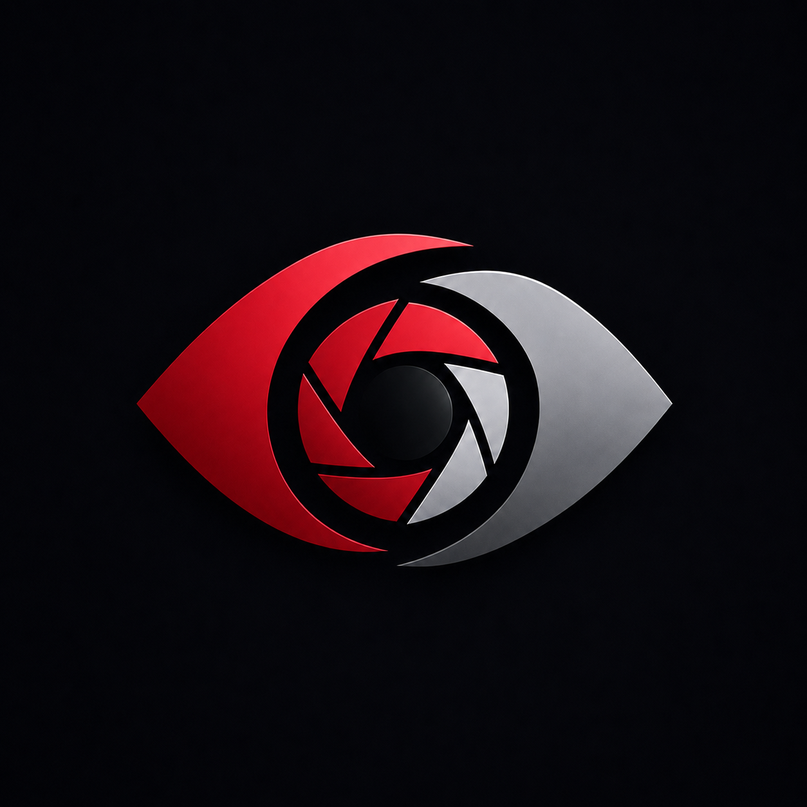
</p>

<h1 align="center">VisionNexus</h1>

<p align="center">
  Suite modulaire de vision par ordinateur pour explorer, annoter, entrainer,
  evaluer et versionner des datasets, localement ou sur une VM Linux.
</p>

<p align="center">
  
  
  
  
  
  
</p>

VisionNexus repose sur des applications independantes, chacune avec son
frontend, son API et son workspace utilisateur. Elles peuvent etre lancees
seules depuis la ligne de commande ou ouvertes dans le client Electron.
L'Orchestrator les relie ensuite dans des pipelines MLOps visuels.

> Le depot contient les sources et les fichiers de verrouillage. Les
> dependances Node, les environnements Python et les poids de modeles sont
> reconstruits ou installes sur la machine cible.

## Vue d'ensemble

<p align="center">
  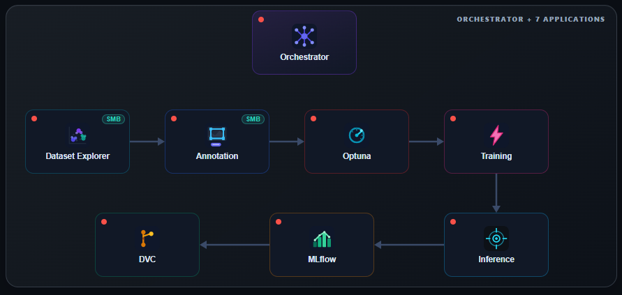
</p>

<p align="center">
  <em>Orchestrator et sept applications : chaque etape du cycle dataset -&gt;
  annotation -&gt; entrainement -&gt; inference reste utilisable seule ou reliee
  dans un pipeline.</em>
</p>

<p align="center">
  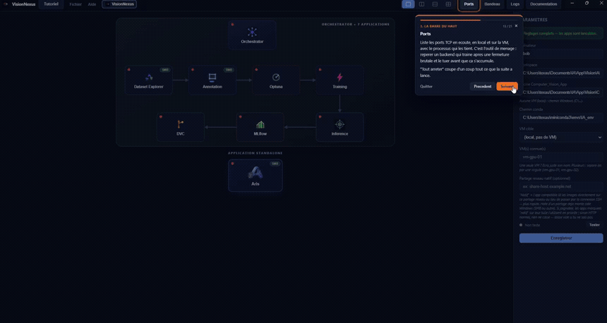
</p>

<p align="center">
  <em>Annotation App : creation d'un projet, premiere boite, propagation
  SAMURAI sur la sequence, masques de segmentation qui suivent les objets,
  export YOLO/COCO et monitoring.</em>
</p>

<table>
  <tr>
    <td width="50%">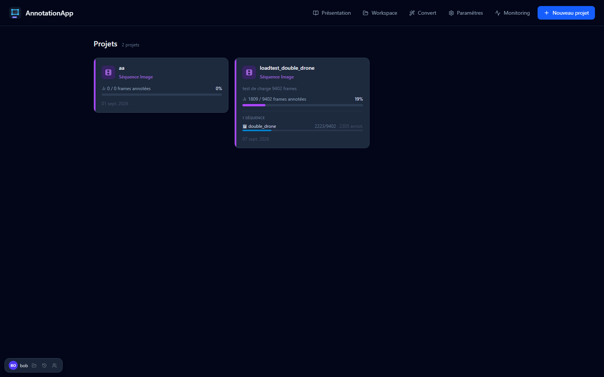</td>
    <td width="50%">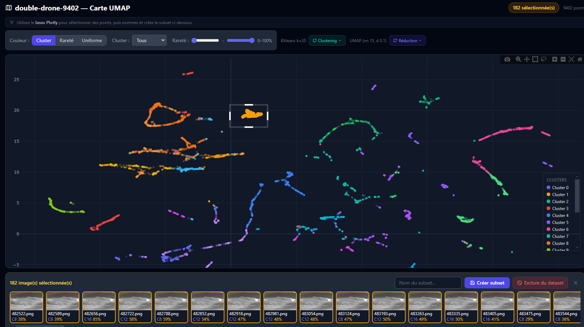</td>
  </tr>
  <tr>
    <td align="center"><strong>Annotation a grande echelle</strong><br />Projets, sequences, progression et assistance IA.</td>
    <td align="center"><strong>Dataset Explorer</strong><br />Projection UMAP des embeddings CLIP, clustering et selection au lasso pour creer des subsets.</td>
  </tr>
</table>

<table>
  <tr>
    <td width="50%">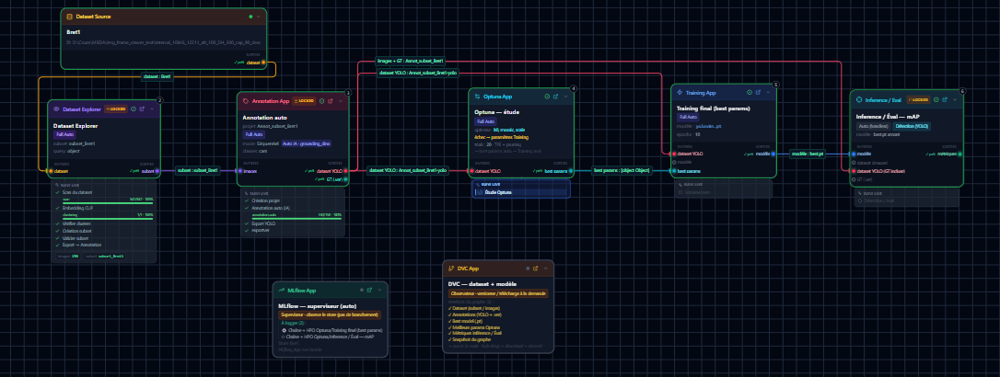</td>
    <td width="50%">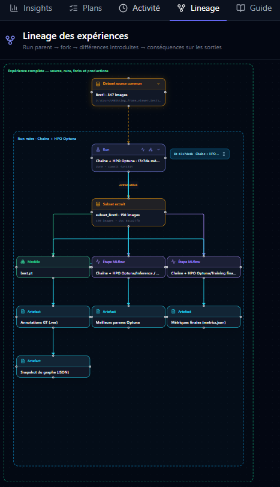</td>
  </tr>
  <tr>
    <td align="center"><strong>Orchestration MLOps</strong><br />DAG visuel complet : dataset, annotation, HPO Optuna, entrainement et evaluation, observes par MLflow et DVC.</td>
    <td align="center"><strong>Lineage des experiences</strong><br />Suit un run parent jusqu'a ses forks, les differences introduites et leurs consequences sur les sorties.</td>
  </tr>
</table>

Le systeme couvre deux usages complementaires :

1. **Applications standalone** : ouvrir uniquement l'outil necessaire, avec
   son propre backend FastAPI, son frontend React/Vite et son workspace.
2. **Suite MLOps orchestree** : construire un graphe qui fait circuler les
   datasets, annotations, modeles, evaluations et versions entre les apps.

## Client desktop

`desktop/` contient **VisionNexusElectron**, le client natif de la suite.
Electron embarque Chromium et Node.js dans un executable portable et affiche
les frontends React existants sans les reecrire.

Depuis son catalogue, le client :

- lance une application localement ou sur une cible Linux via SSH ;
- transmet `--user`, `--workspace` et l'environnement Python au launcher ;
- lit les ports reellement alloues sur la sortie du launcher ;
- cree automatiquement les tunnels SSH necessaires ;
- attend la disponibilite du backend avant d'ouvrir la fenetre de l'app ;
- ferme les processus et tunnels associes lorsque la fenetre est fermee ;
- propose, pour les flux d'images compatibles, une lecture native via partage
  de fichiers avec repli HTTP.

Le renderer Electron conserve une isolation stricte :
`contextIsolation: true`, `sandbox: true` et `nodeIntegration: false`. Les
operations systeme, SSH et fichiers restent dans le processus principal.

Documentation du client :
[desktop/README.md](desktop/README.md).

## Applications standalone

Toutes les apps ci-dessous peuvent etre lancees seules. Les ports indiques sont
les bases par defaut ; le launcher choisit automatiquement des ports libres
quand plusieurs instances coexistent.

| Application | Role | Capacites principales | Sorties |
|---|---|---|---|
| 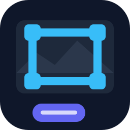<br />[Annotation](Annotation_App/README.md) | Annotation d'images et de sequences | Timeline sparse, images 16 bits, classes hierarchiques, Grounding DINO, SAM, SAMURAI, homographie, flux optique, tracking et correction d'anomalies | Annotations, exports YOLO, projets multi-sequences |
| 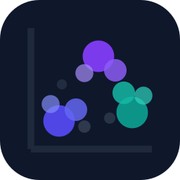<br />[Dataset Explorer](Dataset_Explorer_App/README.md) | Exploration et selection de datasets | Embeddings CLIP, index FAISS, recherche texte/image, doublons, UMAP/t-SNE/PCA, clustering, rarete et lasso | Subsets reutilisables et exports vers Annotation |
| 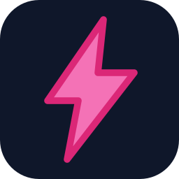<br />[Training](Training_App/README.md) | Entrainement de modeles | YOLO v8/v9/v10/v11, hyperparametres, progression SSE et metriques par epoch | Poids entraines, historique de runs et metriques MLflow |
| 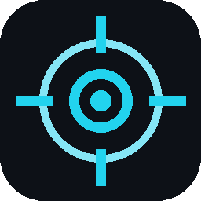<br />[Inference](Inference_App/README.md) | Inference, evaluation et acquisition | Detection, SOT/MOT, ByteTrack, BoT-SORT, BoostTrack, SAM2, replay, flux MJPEG/ZMQ, evaluation MOTA/IDF1/mAP | Videos annotees, tracks, benchmarks, evaluations et datasets acquis |
| 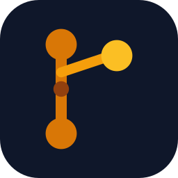<br />[DVC](DVC_App/README.md) | Versioning des donnees | Initialisation de depot, ajout, commit, tags, historique et comparaison des versions | Versions reproductibles de datasets et annotations |
| 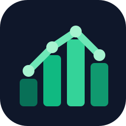<br />[MLflow](MLflow_App/README.md) | Suivi d'experiences | Runs, parametres, metriques, artefacts, comparaison et registre de modeles | Historique d'experiences partage dans le workspace utilisateur |
| 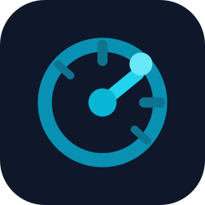<br />[Optuna](Optuna_App/README.md) | Optimisation d'hyperparametres | Etudes, trials, distributions, objectifs et visualisation de progression | Meilleurs parametres et historique d'optimisation |
| 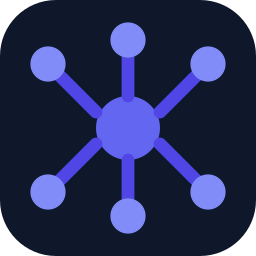<br />[Orchestrator](Orchestrator_App/README.md) | Pilotage MLOps | Editeur de DAG, validation des connexions, auto-lancement des apps, gates humaines, SSE, activite et lineage | Pipelines, manifests de runs et graphe de lineage |

### Ports de base

| Cle launcher | Backend | Frontend | Workspace |
|---|---:|---:|---|
| `annotation` | 8000 | 5173 | `annotation_<user>/` |
| `explorer` | 8001 | 5174 | `explorer_<user>/` |
| `training` | 8064 | 5176 | `training_<user>/` |
| `inference` | 8065 | 5177 | `inference_<user>/` |
| `dvc` | 8061 | 3002 | `dvc_<user>/` |
| `mlflow` | 8062 | 3001 | `mlflow_<user>/` |
| `optuna` | 8063 | 3003 | `optuna_<user>/` |
| `orchestrator` | 8060 | 3000 | `orchestrator_<user>/` |

## Suite MLOps

L'Orchestrator utilise un graphe dirige pour transformer une intention
visuelle en pipeline executable. Chaque noeud appelle le contrat HTTP de
l'application concernee, conserve les chemins de sortie et propage les
artefacts vers les etapes suivantes.

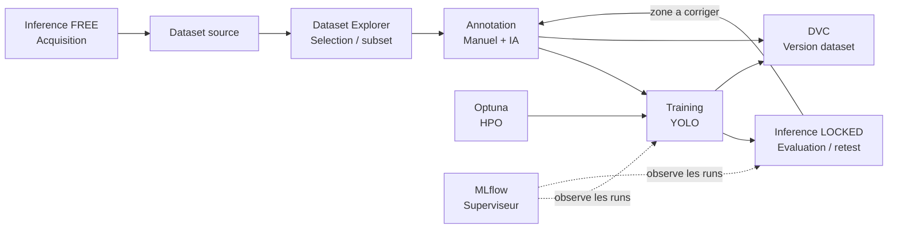

Principes du graphe :

- **Inference FREE** n'a pas d'entree : elle acquiert un flux et produit un
  dataset d'images.
- **Inference LOCKED** recoit un dataset ou un modele : elle infere ou evalue.
- **MLflow** est un superviseur serverless du store utilisateur, pas une etape
  qui transforme les donnees.
- **Optuna** fournit les meilleurs hyperparametres a Training.
- **DVC** fige les datasets, annotations et sorties importantes.
- Les gates humaines permettent de verifier une annotation, un entrainement ou
  une anomalie avant de continuer le DAG.

Voir [l'architecture Orchestrator](Orchestrator_App/docs/architecture.md) et
les [scenarios de test](Orchestrator_App/docs/test-scenarios.md).

## Architecture d'execution

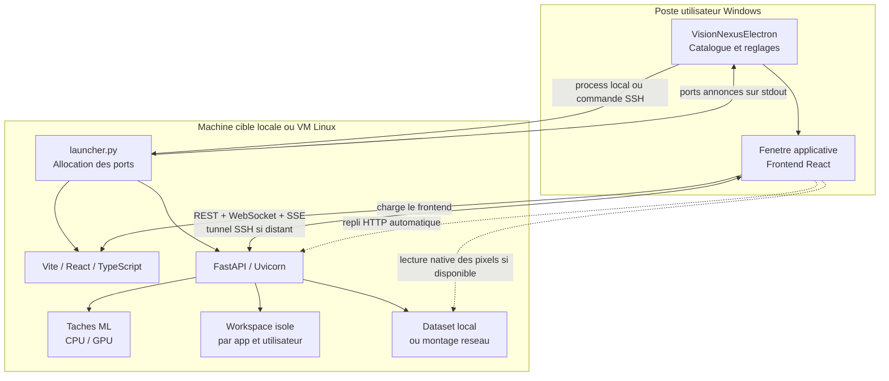

### Deroulement d'un lancement distant

1. Electron ouvre une session SSH et execute `launcher.py` sur la cible.
2. Le launcher cree le workspace utilisateur et reserve deux ports libres.
3. Uvicorn demarre le backend ; Vite sert le frontend.
4. Les ports reels sont annonces sur `stdout`.
5. Electron ouvre un second SSH dedie au forwarding de ces ports.
6. La readiness HTTP est verifiee, puis le frontend est charge dans une
   fenetre native.
7. REST transporte les commandes et metadonnees ; WebSocket ou SSE transporte
   les apercus, progressions et evenements temps reel.

### Images natives et SMB

Dans Annotation App, le protocole Electron `app-image://` peut eviter de
transporter les pixels lourds dans le tunnel HTTP :

1. le frontend demande au backend le chemin natif de la frame ;
2. Electron lit le fichier sur le partage accessible depuis le poste client ;
3. si le partage ou les permissions sont indisponibles, l'URL HTTP habituelle
   est utilisee automatiquement.

Pendant un run de tracking, le backend lit de son cote les frames directement
sur son disque local ou son montage SMB. Il n'effectue donc pas une requete HTTP
par frame. Seuls les apercus et annotations utiles sont envoyes au frontend par
le canal temps reel.

Documentation detaillee :
[optimisation HTTP/SMB](Annotation_App/docs/optimisation_http_smb.md) et
[chargement des images](Annotation_App/docs/explained_loading_image.md).

## Workspaces et multi-instance

Le launcher impose un espace independant pour chaque couple
`application/utilisateur` :

```text
<racine-workspaces>/
  annotation_alice/
  explorer_alice/
  training_alice/
  inference_alice/
  orchestrator_alice/
  dvc_alice/
  mlflow_alice/
  optuna_alice/
```

Les bases SQLite, caches, projets, exports, runs et reglages restent hors du
code source. Deux utilisateurs ne partagent donc pas leurs donnees locales par
accident.

Le registre `.run/.instances.json` recense les processus actifs. A chaque
lancement, `_lib/launcher_engine.py` cherche des ports libres a partir des
ports de base et evite ceux deja reserves. Les ports peuvent aussi etre forces
pour un lancement unique avec `--backend-port` et `--frontend-port`.

## Stack technique

| Couche | Technologies | Responsabilite |
|---|---|---|
| Desktop | Electron, Node.js, TypeScript, electron-builder | Catalogue, processus locaux, SSH, tunnels, fenetres et protocole d'images |
| Frontend | React, TypeScript, Vite, TanStack Query, Zustand, Tailwind CSS | Interfaces, cache serveur, etat interactif et visualisations |
| Backend | Python 3.11+, FastAPI, Uvicorn, Pydantic, SQLModel, HTTPX | API, validation, taches, persistance et contrats Orchestrator |
| Temps reel | WebSocket, SSE, MJPEG | Apercus de tracking, progression et metriques |
| Donnees | SQLite WAL, fichiers du workspace, DVC, MLflow | Projets, runs, lineage, versions et artefacts |
| Vision / ML | PyTorch, OpenCV, Ultralytics, CLIP, FAISS, SAM, trackers MOT/SOT | Annotation assistee, embeddings, entrainement et inference |
| Execution distante | SSH, port forwarding, SMB optionnel | Pilotage de VM et transport efficace des images |

Les versions CUDA, PyTorch et pilote NVIDIA doivent etre compatibles. Les
poids ne sont pas telecharges automatiquement : consultez
[MODEL_WEIGHTS.md](MODEL_WEIGHTS.md) pour leurs sources, licences et
emplacements attendus.

## Installation

### Prerequis

- Python `3.11+` ;
- Node.js `20 LTS+` et npm ;
- Git `2.40+` recommande ;
- un environnement Python contenant les dependances des apps utilisees ;
- facultatif : GPU NVIDIA, CUDA et PyTorch GPU pour les traitements lourds ;
- facultatif : client SSH et acces au partage SMB pour une cible distante.

```bash
git clone https://github.com/a-texier/VisionNexus.git
cd VisionNexus
```

Les dependances Python specialisees sont decrites dans la documentation de
chaque application. Ne melangez pas les wheels PyTorch CPU et CUDA dans le meme
environnement.

## Reconstruction complete

Depuis une copie fraiche, cette commande restaure les dependances Node
verrouillees par les `package-lock.json`, compile toutes les interfaces React
et compile le code TypeScript Electron :

```bash
python rebuild_all.py
```

Pour produire aussi le client desktop de la plateforme courante :

```bash
python rebuild_all.py --package-desktop
```

Resultats :

- Windows : `desktop/release/VisionNexusElectron.exe` ;
- Linux : AppImage dans `desktop/release/`.

Pour une iteration locale utilisant des `node_modules` deja conformes :

```bash
python rebuild_all.py --skip-install
```

Reconstruction manuelle du desktop uniquement :

```bash
cd desktop
npm ci
npm run dist:win
```

Voir [desktop/cmd_build_desktop.txt](desktop/cmd_build_desktop.txt).

## Lancement

### Application seule

```bash
python launcher.py \
  --app annotation \
  --workspace /chemin/vers/workspaces \
  --user alice
```

Exemples :

```bash
python launcher.py --app explorer --workspace /data/workspaces --user alice
python launcher.py --app inference --workspace /data/workspaces --user alice
python launcher.py --app training --workspace /data/workspaces --user alice
```

### Plusieurs applications

```bash
python launcher.py \
  --app explorer annotation training \
  --workspace /data/workspaces \
  --user alice
```

### Orchestrator

```bash
python launcher.py \
  --app orchestrator \
  --workspace /data/workspaces \
  --user alice
```

L'Orchestrator lance ensuite les sous-applications demandees par les noeuds du
graphe. Il reste possible de les ouvrir separement pour intervenir manuellement
sur une gate ou inspecter un run.

### Backend uniquement

```bash
python launcher.py \
  --app annotation \
  --workspace /data/workspaces \
  --user alice \
  --backend-only
```

### Depuis VisionNexusElectron

1. construire ou recuperer `VisionNexusElectron.exe` ;
2. renseigner l'utilisateur, la racine des workspaces et la racine du depot ;
3. choisir `Local` ou une cible SSH ;
4. cliquer sur l'icone d'une application ;
5. consulter le log integre pendant le lancement.

Le client utilise exactement le meme `launcher.py` que la ligne de commande.
Les workspaces, contrats API et regles de ports sont donc identiques dans les
deux modes.

## Utilisation distante

Le schema recommande est :

- **VM Linux** : code applicatif, environnement Python/CUDA, backend, frontend,
  modeles et acces au dataset ;
- **poste Windows** : VisionNexusElectron, tunnels SSH et affichage ;
- **workspace** : chemin persistant monte sur la VM ;
- **SMB** : partage facultatif pour permettre la lecture native des images.

Le mode HTTP reste fonctionnel sans SMB. Le partage natif est une optimisation,
pas une condition de demarrage.

## Documentation

### Suite et integration

| Sujet | Documentation |
|---|---|
| Index general | [docs/README.md](docs/README.md) |
| Architecture, ports et contrats | [docs/ECOSYSTEM.md](docs/ECOSYSTEM.md) |
| Ajouter une application | [docs/ADDING_AN_APP.md](docs/ADDING_AN_APP.md) |
| Modele d'application | [docs/APP_TEMPLATE.md](docs/APP_TEMPLATE.md) |
| Installation des modeles | [MODEL_WEIGHTS.md](MODEL_WEIGHTS.md) |
| Client Electron | [desktop/README.md](desktop/README.md) |

### Par application

| Application | Vue d'ensemble | Architecture et guides |
|---|---|---|
| Annotation | [README](Annotation_App/README.md) | [Index](Annotation_App/docs/README.md), [architecture](Annotation_App/docs/architecture.md), [algorithmes](Annotation_App/docs/algorithmes.md), [installation](Annotation_App/docs/SETUP_STEP_BY_STEP.md), [performance distante](Annotation_App/docs/optimisation_http_smb.md) |
| Dataset Explorer | [README](Dataset_Explorer_App/README.md) | [Index](Dataset_Explorer_App/docs/README.md), [architecture](Dataset_Explorer_App/docs/architecture.md), [guide developpeur](Dataset_Explorer_App/docs/developer-guide.md) |
| Training | [README](Training_App/README.md) | [Reference](Training_App/docs/README.md) |
| Inference | [README](Inference_App/README.md) | [Index](Inference_App/docs/README.md), [architecture](Inference_App/docs/architecture.md), [algorithmes](Inference_App/docs/algorithms.md), [deploiement](Inference_App/docs/deployment.md), [qualite](Inference_App/docs/quality.md) |
| Orchestrator | [README](Orchestrator_App/README.md) | [Index](Orchestrator_App/docs/README.md), [architecture](Orchestrator_App/docs/architecture.md), [scenarios](Orchestrator_App/docs/test-scenarios.md) |
| DVC | [README](DVC_App/README.md) | API, versions et integration Orchestrator |
| MLflow | [README](MLflow_App/README.md) | Experiences, runs et registre de modeles |
| Optuna | [README](Optuna_App/README.md) | Etudes, trials et integration Training |

## Licence

Le code original est distribue sous `AGPL-3.0-only`. Une licence commerciale
separee peut etre negociee pour un usage proprietaire sans les obligations de
l'AGPL applicables au code original. Les bibliotheques, trackers et modeles
tiers conservent leurs propres licences.

Voir [LICENSE](LICENSE), [COMMERCIAL_LICENSE.md](COMMERCIAL_LICENSE.md),
[THIRD_PARTY_NOTICES.md](THIRD_PARTY_NOTICES.md) et
[CONTRIBUTING.md](CONTRIBUTING.md).
